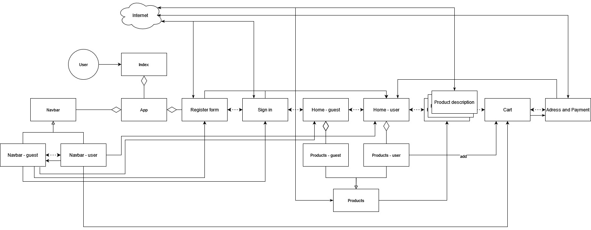

Mateusz Ptaszyński, Krzysztof Reczek
# Aim of the project
We want to create web store, for selling axes. It should work in most popular browsers, be easy to use and well designed. It has to have option of registering and signing in, browsing products (and their specialized data) and adding products to the cart. Cart should be editable, also there has to be page for ordering selected products.
# Setup
## Frontend

After downloading the code, follow these steps to set up the frontend:

1. Navigate to the frontend directory:
    ```bash
    cd frontend
    ```

2. Install the necessary dependencies:
    ```bash
    npm install
    ```

3. Start the application:
    ```bash
    npm run
    ```

## Backend
### Step 1: Configure Environment Variables

TwinAxeShop requires the configuration of certain environment variables related to database connectivity and JWT authentication. These are defined in the `application.properties` file and must be set prior to running the application:

- `DB_HOST`: Database URL (e.g., `jdbc:mysql://localhost:3306/twinaxeshop_db`)
- `DB_USERNAME`: Database username
- `DB_PASSWORD`: Database password
- `JWT_KEY`: Secret key for JWT token signing

### Step 2: Configuring Environment Variables in IntelliJ IDEA

To configure environment variables in IntelliJ IDEA:

1. Open the project in IntelliJ IDEA.
2. Navigate to the `Run` menu and select `Edit Configurations...`

3. In the `Run/Debug Configurations` window, select your Spring Boot application.

4. Click `Modify options`.

5. From the `Operating System` section, select `Environment variables.`

6. In the `Environment variables` input field, enter your variables as key-value pairs, separated by semicolons:
```
JWT_KEY=sQF1C+qQJpmV9A/M8/LPd5esayq2dpG/cD0MCEwJZjM;DB_HOST=jdbc:mysql://localhost:3306/twixAxeShop?allowPublicKeyRetrieval=true&useSSL=false&serverTimezone=UTC&useLegacyDatetimeCode=false;DB_USERNAME=root;DB_PASSWORD=admin12345
```

7. Click `Apply` and then `OK` to save the configuration.

### Step 3: Building the Application

To build the TwixAxeShop application, use the following Maven command:

```bash
mvn clean install
```

This command compiles the project and runs any tests, ensuring the application is correctly set up.

### Step 4: Running the Application

After successfully building the project, run it with Maven by executing:

```bash
mvn spring-boot:run
```

This starts the TwixAxeShop backend, making it accessible at `http://localhost:8080`.

# Libraries and tools
## Frontend
1. React
2. React Router DOM
3. Tailwind CSS
## Backend
1. Java JDK 17
2. Maven 3.6.3
3. Spring Boot 3.1.5
3. MySQL Database

# UML diagram
This UML Diagram shows how we connected classes in our project:


